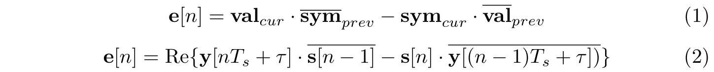
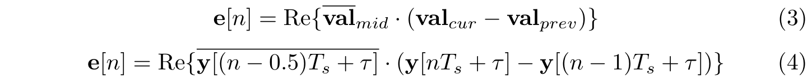
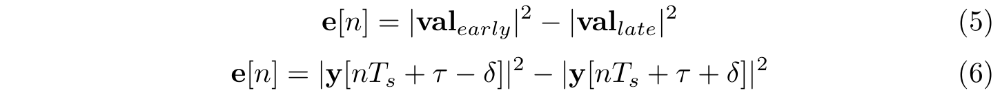
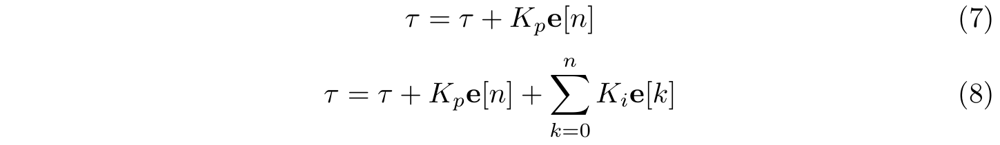
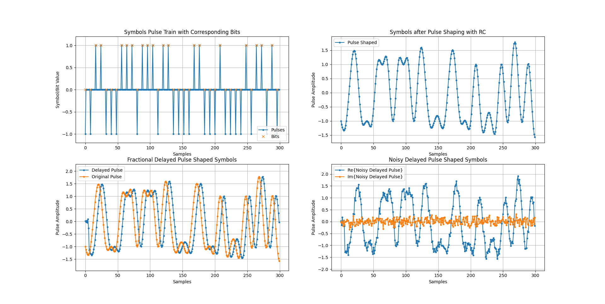
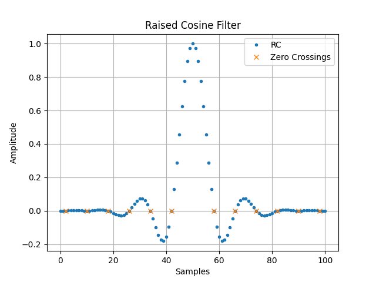
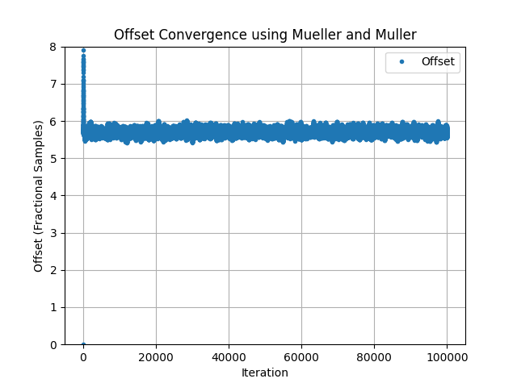
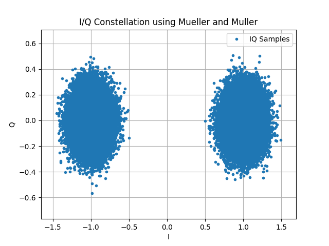
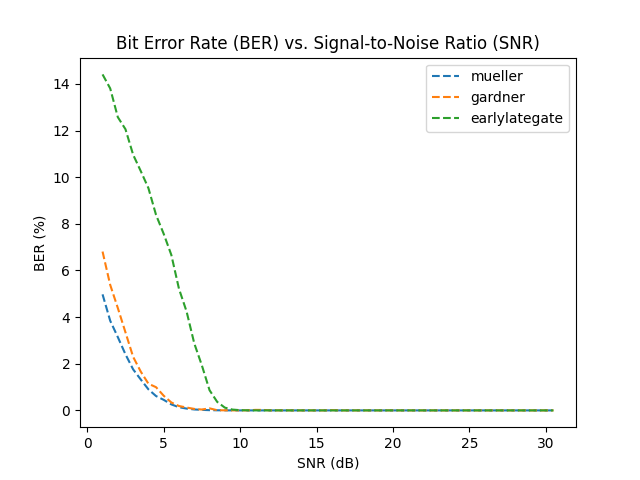

# Timing Error Detector Simulation
This repository provides Python code simulating three timing error detectors (TED): Mueller and Muller (M&M), Gardner, and Early-Late Gate. The simulation recovers the timing offset of a noisy, delayed signal that has been digitally modulated using Binary Phase-Shift Keying (BPSK). The purpose of this simulation is to ultimately compare the performance of the TED, mainly using a Bit Error Rate (BER) vs. Signal-to-Noise (SNR) ratio curve to demonstrate robustness of the TED to noise. Furthermore, the code is modular and many of the parameters can be changed to simulate different TED scenarios. The rest of this repository will cover the background. simulation, and results. If someone desires to skip straight to the code, `testbench.py` is main file to run and edit parameters from.

## Background
Once a carrier signal is received and downconverted to baseband, such as through the use of a local oscillator (LO), an analog-to-digital converter (ADC) samples and quantizes it into a digital message signal. At this stage, there are usually two main issues with the signal: noise, and offsets. The noise is usually handled via filtering, which can occur prior to the ADC or after, and aims to maximize the SNR. The offsets are either time or frequency based, where frequency offsets can occur due to LO mistmatches. Timing offsets, the focus of this work, are when the samples we select from the digital signal are misaligned with the ideal positions. When the carrier travels through the air, this takes some amount of time, andit  may experience reflections which all contribute to delay in the signal at arrival time. Therefore, to recover the optimal samples from the message signal, a TED must be used to correct this time delay/offset.

The process for finding this timing offset stays the same for the different TED. First, the digital signal is upsampled so there are more sampels to work with. This allows better resolution for correcting fractional offsets. For example, if our received signal was delayed by 3.7 samples, then at the current sample resolution we'd have to round to a 4 sample offset. However, if we upsample, there are now more samples to choose from in between 3 and 4 which brings us closer to the 3.7 fractional offset.

Next we enter the iterative loop to converge to the correct offset. At the start of every iteration, some currently chosen offset must be applied to select a value from the upsampled signal. This chosen offset updates each loop and should eventually reach an optimal solution. Then, depending on the TED chosen, an error term is calculated, proportionally indicating how far off the current offset is from the ideal offset. This error term is then used to update to a new offset, and the loop repeats itself.

Three TED were used in this work. The first is the M&M method which can be mathematically represented as shown in EQ (1) and EQ (2) below.

<div align="center">
  
</div>

Let **y**[*nT<sub>s</sub>*] be the received signal, meaning it contains the noisy, delayed, pulse shaped symbols prior to upsampling. *T<sub>s</sub>* is the symbol period, and **s**[*n*] is the sequence of decided symbols for symbol *n*. The bar indicates to take the complex conjugate, and $\tau$ is the delay/offset of which the TED tries to converge to. EQ (1) is the same as EQ (2), just written in a text based form for clarity where *val* is value, *sym* is symbol, and the subscripts indicate if it is the current or previous (one symbol period prior) version. Note that the presence of the decided symbol sequence means that this is a decision-directed TED.

The second TED used is the Gardner method shown in EQ (3) and EQ (4).

<div align="center">
  
</div>

EQ (3) and EQ (4) are equivalent, and the only new term corresponds to *val<sub>mid</sub>* which is the received value half a symbol period between the current and previous values. Since this method only relies on the received values, it is considered non-data-aided (NDA).

The final TED used is the Early-Late Gate method shown in EQ (5) and EQ (6).

<div align="center">
  
</div>

This introduces a new term $\delta$ which is some small shift usually around *T<sub>s</sub>*/4 or *T<sub>s</sub>*/8. EQ (5) and EQ (6) are equal, and the values being either early or late are with respect to some current value of interest.

For all the TED, **e**[*n*] is the error value computed which is then used to update the offset in the Phase-Locked Loop (PLL). This code provides two options for this update. The first is a proportional-only update which just scales the error and sums to the offset. This is represented in EQ (7). EQ (8) is the second method known as the proportional integral (PI) method which maintains the immediate proportional update of EQ (7) but adds in an accumulated (or integral) error term.

<div align="center">
  
</div>

To clarify, *K<sub>p</sub>* is the proportional gain and *K<sub>i</sub>* is the integral gain.

## Simulation
There are two modes that can be ran in the simulation from `testbench.py`: single run, and compare run. Single run mode will generate one BPSK signal and perform the TED loop for one specified method. This is controlled by `SINGLE_RUN` and `SINGLE_RUN_METHOD`. Compare run will generate one BPSK signal, but perform the TED loop for all methods across a range of SNR. This is controlled by `COMPARE_RUN`, `MIN_SNR`, `MAX_SNR`, and `SNR_STEP`. Furthermore, if you want to save or load the results of the compare run, you can use `SAVE_DATA` and `LOAD_DATA`, respectively.

Here, I will walk through a single run using the M&M TED to demonstrate the simulation process. So, I set `SINGLE_RUN = False`, `SINGLE_RUN_METHOD = 'mueller'`,  `SINGLE_RUN_SNR = 15`, and the parameters as follows:
```
num_symbols = 100000
sps = 8 # samples per symbol
rc_taps = 101 # raised cosine taps
rolloff = 0.3 # raised cosine rolloff
int_delay = 5
frac_delay = 0.7 # int_delay + frac_delay = total delay in samples
sinc_taps = 21
upsample = 32
is_complex = True
```
The following figures provide a visualisation for the major process performed. This includes creating the symbol pulse train, pulse shaped, delayed, and noisy signals. Since the modulation is BPSK, the symbols are {-1,+1} which corresponds to binary 0 and binary 1, respectively. After a random binary sequence with 100000 bits is generated, the following figure works chronologically through the pulse shaping steps.

<div align="center">
  
</div>

The number of symbols is set to 100000 at 8 samples per symbol, so the plots above are zoomed in as shown by the x-axis in samples. From the binary sequence, the symbol pulse train can be created with the appropriate samples per symbol. The corresponding bits were also marked. To pulse shape the symbols, I convolved the pulse train with a raised cosine (RC), which would be similar to the process of matched filtering with two root raised cosines. The following figure visualizes the RC curve, along with the zero crossing marked.

<div align="center">
  
</div>

Referring back to the grid of plots, the result of the convolution is the top right plot. This is the ideal signal to be transmitted. After receiving this signal, there would be some delay and noise included. The bottom left plot shows the signal delayed by `int_delay + frac_delay` compared against the original unshifted signal. Then, the final plot shows the signal after AWGN was included. The AWGN added in was complex, so the signal now has a real and imaginary component. This delayed and noisy complex signal is the starting point for the TED loop.

## Results
This section presents the results of the single run mode, discussed in the Simulation section, as well as results of running the compare run mode. All modes are running off the same example previously presented. Prior to running the timing detector, the noisy delayed signal was upsampled by a factor of 32, meaning there are now 32 x 8 = 256 samples per symbol. The following figure shows a portion of this interpolated signal along with the original samples it was upsampled from.

<div align="center">
  
</div>

For the single run mode, the selected TED was M&M with the proportional only PLL update. The default value for the proportional only gain is *K<sub>p</sub>* = 0.1. The following figure shows the offset $\tau$ converging over the TED iterations.

<div align="center">
  
</div>

The plot shows $\tau$ converging to 5.7 samples, which is the correct offset since `int_delay = 5` and `frac_delay = 0.7`. The offset convergence confirms the TED using M&M operated correctly. We can further visualize the timing correction through an I/Q constellation. Since the received signal is digitally modulated for BPSK with no frequency offset and symbols {-1,+1}, the expectation will be two clusters around I = +1 and I = -1.

<div align="center">
  
</div>

At a SNR of 15 dB, the TED recovered a perfect I/Q constellation separation between the BPSK symbols. Furthermore, in the line `SingleTED.plot_final_constellation(SINGLE_RUN_METHOD, keep_all=False)` which plots the constellation, the `keep_all=False` discards the first 30 samples values. This simulates the concept of a bit stream preamble which is usually a pattern of starts bits that are used to calibrate the offset prior to the information bits being sampled.

Pivoting to the compare run mode, all three TED were used to recover the timing offset across a range of SNR `MIN_SNR = 1` to `MAX_SNR = 30`. The `keep_all=False` discarded the preamble 30 sampled values, and the BER for each TED and SNR was calculated as shown in the figure below.

<div align="center">
  
</div>

All TED covnerge to around 0% BER by SNR = 10 dB. The M&M method is the most robust to noise, followed by Gardner, then followed by Early-Late Gate. M&M is most likely the best performer because it is the only decision-directed method of these three. Therefore, if the TED can be decision directed, these results suggest that method would be better informed. Otherwise, if the method is NDA, then it is better to sample values spaced further apart (such as in Gardner) as opposed to spaced locally (such as in Early-Late Gate).
